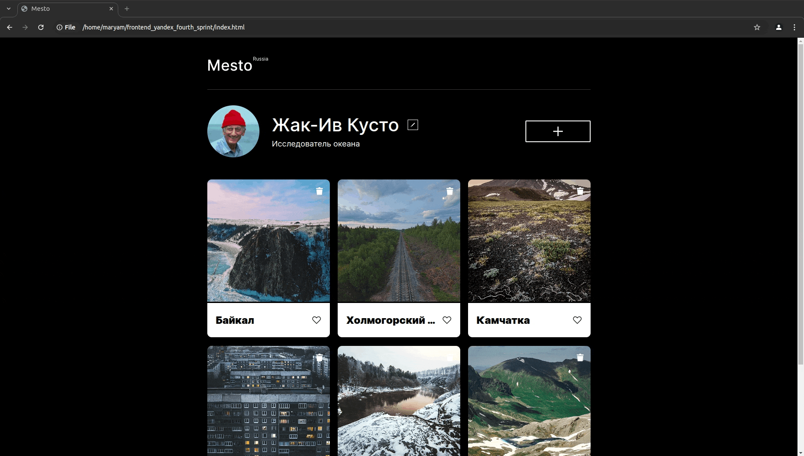

# Путешествия по России — адаптивная вёрстка

## Демонстрация проекта



---

## Используемые технологии

- HTML — семантическая разметка  
- CSS — адаптивная и кросс-браузерная стилизация  
- Grid Layout — построение сложных сеток  
- Flexbox — выравнивание элементов  
- БЭМ (Nested) — файловая структура проекта  
- Медиа-запросы — поддержка разных устройств  

---

## Описание проекта

Продолжение проекта «Путешествия по России», выполненное с акцентом на **полную адаптивность**.  
Проект разработан в рамках **Яндекс Практикума**.

Реализовано:
- Адаптивное поведение блоков;
- Гибкие сетки и изображения;
- Корректное отображение на всех популярных разрешениях;
- Строгая структура по методологии БЭМ.

---

## Как запустить проект локально

1. Клонируйте репозиторий:
```bash
git clone https://github.com/maryamgab/frontend_yandex_fourth_sprint.git
cd frontend_yandex_fourth_sprint
```

2. Запуск:
```bash
# Windows
start index.html

# macOS
open index.html

# Linux
xdg-open index.html
```